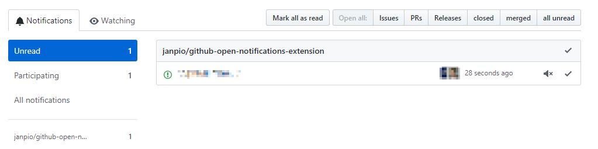

# GitHub Open Notifications Extension

This extension adds several `Open all: ...` buttons in GitHub's notifications view which, when clicked, will open the related notifications in a new tabs and mark them as read.

## Installation

Simply install the extension directly from the Chrome Store: TBD

## Known limitation

The buttons only appears on page load. If a user clicks the notification button on the left hand side of the screen that will (re)load the notification views using PJAX, and as such the page load event won't trigger adding the button back again. Simply refresh the page. (The original developer of the extension this is based on hopes to make the button appear based on the rendering events and not the page load event. I hope so as well and will investigate this myself.)

## Contributing

Pull requests are welcome as well as issues reporting problems or providing feedback.

The extension is extremely simple and as such it doesn't include a package manager and/or build tool. To develop the extension simply clone the repository and load the unpacked extensions directly into Google Chrome.

:octocat::heart:
